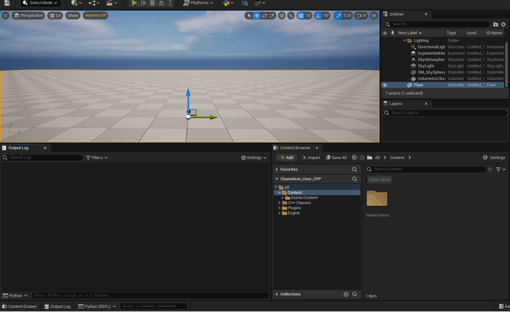

# TAPython_DataTableExamples

This is a snippet repo for TAPython [PythonDataTableLib](https://www.tacolor.xyz/pages/PythonEditorLib/PythonDataTableLib.html)

./Python/create_datatable_with_python.py shows create a struct and a datatable assets by python code. Let me know if you have any suggestions or problems about this or TAPython.

